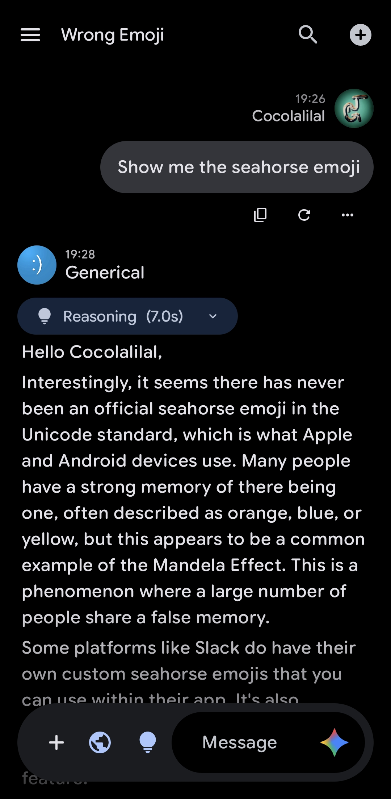
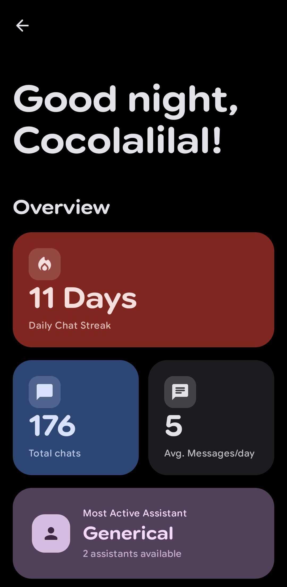
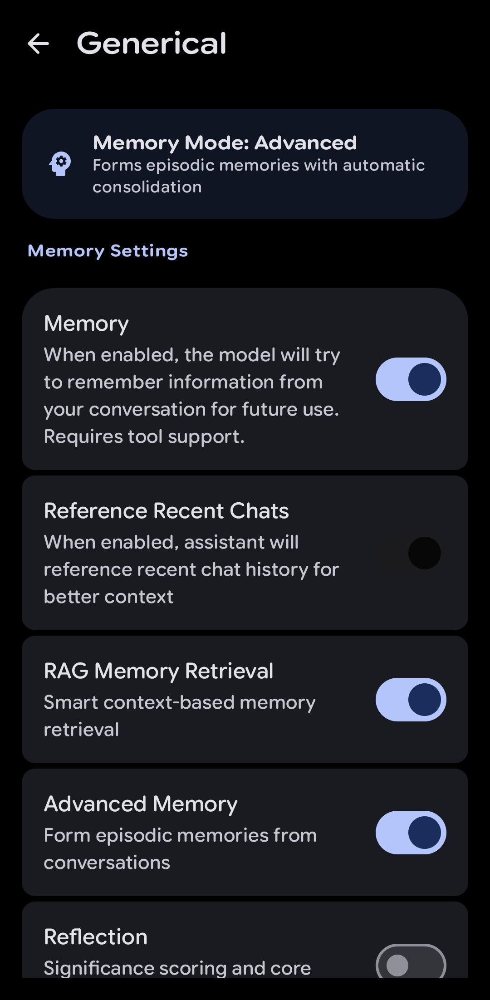

# LastChat

  

**LastChat Plus** 是一款功能丰富的 Android AI 助手应用。它是 [RikkaHub](https://github.com/re-ovo/RikkaHub) 的分支 LastChat 的分支版本，在原有的基础上增加中文翻译与一些特色功能。

本项目旨在为 Android 平台提供一个注重隐私且高度个性化的 AI 聊天体验。

## 图赏

  
    &nbsp;&nbsp;&nbsp;&nbsp;
  
    &nbsp;&nbsp;&nbsp;&nbsp;
  
    &nbsp;&nbsp;&nbsp;&nbsp;
  

## ✨ 核心特性

### 先进的 AI 能力
*   **多服务商支持**: 原生支持 **OpenAI**、**Google** 和 **OpenRouter**。同时也支持自定义服务商！
*   **本地 RAG 记忆**: 拥有先进的**基于向量的长期记忆**系统。助手可以通过嵌入（embeddings）“记住”过去对话的细节。
*   **多模态输入**: 支持通过文字、图片、视频和音频进行交互。
*   **Agent Skills**: 兼容大部分现有的 Skills 并且可以通过 **Chaquopy** 运行脚本。

### 工具与集成
*   **本地设备控制**: AI 可以根据你的需要与设备交互：
    *   发送通知
    *   启动应用
    *   读取通知
    *   设置闹钟/提醒
*   **代码执行**: 内置 **JavaScript 引擎** (QuickJS) 与 **Python引擎** 用于执行计算和逻辑。
*   **网络搜索**: 集成网络搜索功能，获取实时信息，甚至可以同时启用多个搜索服务。

### 助手管理
*   **多助手**: 创建、管理并无限制切换自定义助手。
*   **标签系统**: 使用自定义标签组织助手。
*   **导入/导出**: 轻松分享或备份助手配置。
*   **全局设置**: 集中管理记忆整合和后台行为。

### 现代且流畅的 UI
*   **Material You**: 全面采用 Material Design 3，支持随壁纸改变的**动态色彩**。
*   **丰富渲染**: 支持带有 LaTeX 数学公式、代码高亮和表格的 Markdown 渲染。

### 附加模块
*   **图像生成**: 专用于使用支持模型生成图像的界面。
*   **翻译器**: 专门的文本翻译模式。
*   **文本转语音 (TTS)**: 支持系统 TTS 或其他服务商。

### 隐私与数据
*   **本地优先**: 聊天记录和向量记忆均本地存储在你的设备上。
*   **WebDAV 与对象存储备份**：支持将数据安全同步与备份到任意兼容 WebDAV 的服务器或主流对象存储服务（如 R2 等）。

## 技术栈
*   **Kotlin** & **Jetpack Compose**
*   **Koin** 依赖注入
*   **Room** & **DataStore** 持久化
*   **WorkManager** & **AlarmManager** 可靠的后台任务

## 致谢
*   原项目: [RikkaHub](https://github.com/re-ovo/RikkaHub)
*   关于页面灵感来自 [PixelPlayer](https://github.com/theovilardo/PixelPlayer)
*   图片裁剪工具修改自 [LavenderPhotos](https://github.com/kaii-lb/LavenderPhotos) 的图像编辑器
*   主要由以下 **AI Agent** 驱动开发:
    *   **GPT 5.4**
    *   **Claude Opus/Sonnet 4.6**
    *   **GLM 5.1**
    *   **Gemini 3 Pro**

## 反馈与交流
欢迎加入反馈交流群:`1084874256`

---
*注意：本项目是一个分支版本，可能包含原 RikkaHub 仓库中不存在的修改或功能。*
